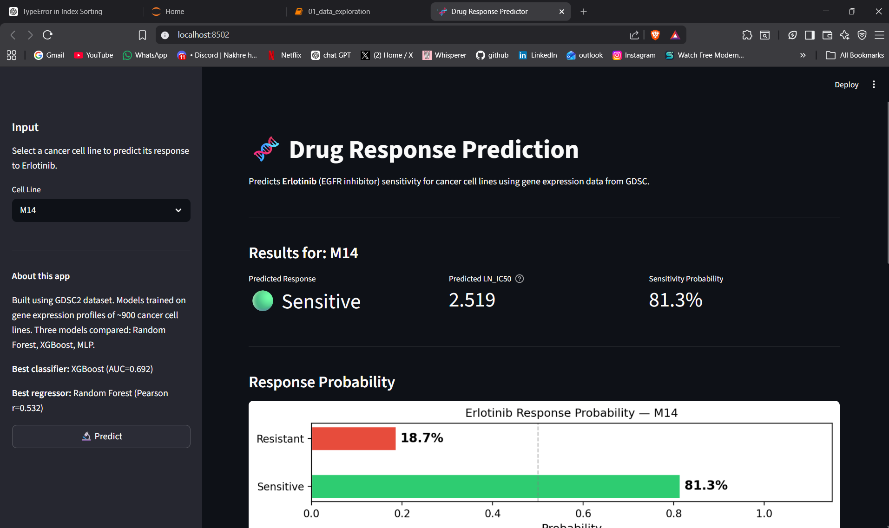

# 🧬 Cancer Drug Response Prediction

A machine learning system that predicts how cancer cell lines respond to anti-cancer drugs using gene expression data from the GDSC2 dataset.

[](https://drug-response-prediction-udu25j8hustdlqfxfqfcep.streamlit.app/)
[](https://www.python.org/)
[](https://www.cancerrxgene.org/)

---

## 🔬 Live Demo


**Try the app:** [drug-response-prediction-udu25j8hustdlqfxfqfcep.streamlit.app](https://drug-response-prediction-udu25j8hustdlqfxfqfcep.streamlit.app/)

Select any cancer cell line and drug from the dropdown — the app instantly predicts whether the cell line will be **Sensitive** or **Resistant**, along with a predicted IC50 value and gene expression profile.

---

## 📌 What This Project Does

Cancer treatment is not one-size-fits-all. The same drug can eliminate one patient's tumour and have zero effect on another. This project builds a computational system that predicts drug sensitivity from a cancer cell line's **gene expression profile** — essentially asking: *given which genes are active in this tumour, will this drug work?*

This is a core problem in **precision oncology**: matching the right drug to the right patient based on the molecular profile of their tumour, rather than using trial and error.

---

## 🧪 Supported Drugs

| Drug | Target | Mechanism | Clinical Use |
|---|---|---|---|
| Erlotinib | EGFR | Kinase inhibition | Lung & head/neck cancer |
| Gefitinib | EGFR | Kinase inhibition | Non-small cell lung cancer |
| Lapatinib | EGFR / HER2 | Dual kinase inhibition | HER2+ breast cancer |
| Cisplatin | DNA | DNA damage | Lung, bladder, ovarian cancer |
| Docetaxel | Tubulin | Mitotic disruption | Breast, lung, prostate cancer |

---

## 📊 Dataset

**Source:** [GDSC2 — Genomics of Drug Sensitivity in Cancer](https://www.cancerrxgene.org/)

The GDSC2 dataset is the world's largest public pharmacogenomics resource, containing IC50 drug sensitivity measurements for ~1,000 cancer cell lines tested against hundreds of anti-cancer drugs.

| Property | Value |
|---|---|
| Cell lines | 891 (after merging) |
| Genes measured | 17,737 |
| Genes used (top variance) | 500 |
| PCA components | 50 |
| Training samples | 712 (80%) |
| Test samples | 179 (20%) |
| Primary drug studied | Erlotinib |

**Files needed to reproduce:**
- `GDSC2_fitted_dose_response.csv` — IC50 values
- `Cell_line_RMA_proc_basalExp.txt` — Gene expression matrix
- `Cell_Lines_Details.xlsx` — Cell line annotations

All files are publicly available at [cancerrxgene.org/downloads](https://www.cancerrxgene.org/downloads/bulk_download) or on [Kaggle](https://www.kaggle.com/datasets/samiraalipour/genomics-of-drug-sensitivity-in-cancer-gdsc).

---

## ⚙️ ML Pipeline

```
Raw GDSC2 data
      │
      ▼
Merge IC50 + gene expression (join on cell line name)
      │
      ▼
Variance thresholding — keep top 500 genes by variance
      │
      ▼
Train / test split (80/20 stratified)
      │
      ▼
StandardScaler → PCA (50 components, 72.2% variance explained)
[fitted on training data only — no data leakage]
      │
      ▼
Train 3 models: Random Forest · XGBoost · MLP Neural Network
      │
      ▼
Evaluate on held-out test set → select best model per task
      │
      ▼
Deploy best models in Streamlit web app
```

Two tasks were framed:
- **Regression** — predict exact LN_IC50 value
- **Classification** — predict Sensitive (1) or Resistant (0)

---

## 📈 Results

### Classification (Sensitive vs Resistant)

| Model | Accuracy | AUC-ROC | F1-Score |
|---|---|---|---|
| **XGBoost** ✅ | **65.4%** | **0.692** | **0.663** |
| Random Forest | 62.0% | 0.683 | 0.634 |
| MLP Neural Net | 59.8% | 0.651 | 0.571 |

### Regression (Predicting IC50 value)

| Model | RMSE | R² | Pearson r |
|---|---|---|---|
| **Random Forest** ✅ | **1.007** | **0.281** | **0.532** |
| XGBoost | 1.032 | 0.245 | 0.506 |
| MLP Neural Net | 1.075 | 0.181 | 0.483 |

> XGBoost is used for classification in the deployed app. Random Forest is used for IC50 regression.
> All results are on the held-out test set (n=179), never seen during training.

---

## 🔍 Key Biological Findings

These patterns were discovered purely from data — no biological knowledge was given to the models:

- **TP63** (Pearson r = −0.32) emerged as the strongest predictor of Erlotinib sensitivity. TP63 is a marker of squamous epithelial cancers, which are EGFR-dependent — consistent with Erlotinib's mechanism as an EGFR inhibitor.
- **HNSC** (head and neck squamous cell carcinoma) was the most sensitive cancer type — matching clinical evidence of EGFR dependence in this cancer.
- **PAAD** (pancreatic adenocarcinoma) was the most resistant — also consistent with published literature.
- **PHC2** (r = +0.33) was the top resistance marker, associated with undifferentiated, therapy-resistant tumours.
- PCA revealed clear clustering of cell lines by tissue of origin, with blood cancers separating completely from solid tumours — validating the biological integrity of the gene expression data.

---

## 🗂️ Project Structure

```
Drug-Response-Prediction/
│
├── app/
│   ├── app.py                     # Streamlit web application
│   ├── cell_line_expression.csv   # Pre-processed gene expression (top 500 genes)
│   ├── cell_line_names.csv        # All available cell lines
│   └── models/
│       ├── Erlotinib_classifier.pkl
│       ├── Erlotinib_regressor.pkl
│       ├── Erlotinib_scaler.pkl
│       ├── Erlotinib_pca.pkl
│       └── ... (same for each drug)
│
├── models/
│   ├── rf_regressor.pkl           # Best regression model
│   ├── xgb_classifier.pkl         # Best classification model
│   ├── scaler.pkl
│   ├── pca.pkl
│   └── model_results.csv          # Performance comparison table
│
├── plots/                         # All EDA and result plots
├── notebooks/                     # Jupyter notebooks
├── requirements.txt
└── README.md
```

---

## 🚀 Run Locally

### 1. Clone the repository
```bash
git clone https://github.com/mitapujari-05/Drug-Response-Prediction.git
cd Drug-Response-Prediction
```

### 2. Create a virtual environment
```bash
conda create -n drugresponse python=3.10
conda activate drugresponse
```

### 3. Install dependencies
```bash
pip install -r requirements.txt
```

### 4. Run the app
```bash
streamlit run app/app.py
```

The app opens at `http://localhost:8501`

> **Note:** The app uses pre-trained models from the `app/models/` folder — no retraining needed to run it.

---

## 🔁 Reproduce the Analysis

To retrain models from scratch:

1. Download the GDSC2 dataset files (links above) into a `data/` folder
2. Run the notebooks in order:
   - `01_data_exploration.ipynb` — data loading, EDA, plots
   - (preprocessing and training code follows in the same notebook)
3. Trained models will be saved to `models/` automatically

---

## 🛠️ Tech Stack

| Layer | Tools |
|---|---|
| Data | pandas, numpy |
| Machine Learning | scikit-learn, XGBoost |
| Visualisation | matplotlib, seaborn |
| Web App | Streamlit |
| Model Persistence | joblib |
| Deployment | Streamlit Community Cloud |
| Version Control | Git / GitHub |

---

## 📚 References

- Yang et al. (2013). *Genomics of Drug Sensitivity in Cancer (GDSC): a resource for therapeutic biomarker discovery in cancer cells.* Nucleic Acids Research. [doi:10.1093/nar/gks1111](https://doi.org/10.1093/nar/gks1111)
- Iorio et al. (2016). *A Landscape of Pharmacogenomic Interactions in Cancer.* Cell. [doi:10.1016/j.cell.2016.06.017](https://doi.org/10.1016/j.cell.2016.06.017)
- GDSC Dataset: [cancerrxgene.org](https://www.cancerrxgene.org/)

---

## 👩‍💻 Author

**Mita Pujari**
B.E. Information Technology — SIES Graduate School of Technology, Mumbai

[](https://linkedin.com/in/mita-pujari-07a421231)
[](https://github.com/mitapujari-05)

---

*Built as a semester project exploring computational approaches to precision oncology.*
